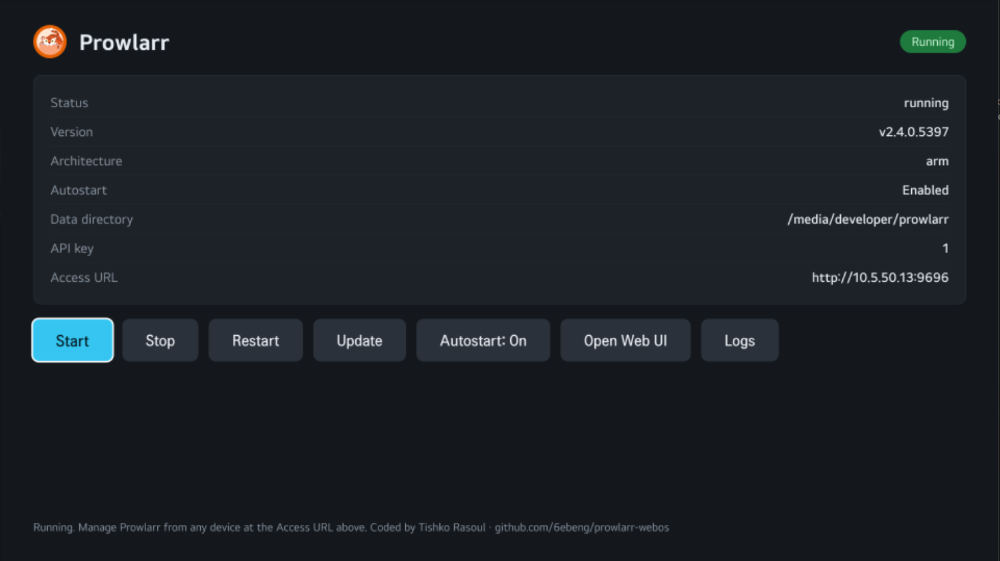

# Prowlarr for webOS

Run [Prowlarr](https://github.com/Prowlarr/Prowlarr) on your LG TV. A webOS homebrew app (`.ipk`) with a small launcher UI plus a background service that downloads, runs and supervises the official Prowlarr build. Manage it from any device at `http://<tv-ip>:9696`.

> Works on both **rooted** (Homebrew Channel) and **non-rooted** (Developer Mode only) webOS TVs. Boot **autostart** requires a rooted TV — on non-rooted TVs the Autostart button is disabled and you launch the app manually after a reboot. API key defaults to `1`.



## Build

```powershell
npm run build
```

## Deploy

```powershell
npm run deploy                                                          # build + install + elevate
powershell -ExecutionPolicy Bypass -File scripts/deploy.ps1 -Autostart  # also enable boot autostart
```

## Usage

1. Launch **Prowlarr** on the TV and press **Start** (first launch downloads ~95 MB).
2. Manage from any device at `http://<tv-ip>:9696`.

Buttons: Start / Stop / Restart / Update / Autostart / Open Web UI / Logs.

## Notes

- Prowlarr binds all interfaces — set an admin account in Settings and keep it on a trusted LAN.
- Data is stored in the first writable path among `/media/developer/prowlarr`, `/home/root/prowlarr`, `/media/internal/.prowlarr`, `/tmp/prowlarr`.

## Layout

```
appinfo/   TV web app (tile + UI)
service/   node service + prowlarr-run.sh supervisor
scripts/   build / deploy (PowerShell)
```

## Credits

[Prowlarr](https://github.com/Prowlarr/Prowlarr) (GPL-3.0, fetched at runtime). Wrapper: MIT. Coded by **Tishko Rasoul** — [github.com/6ebeng/prowlarr-webos](https://github.com/6ebeng/prowlarr-webos)
